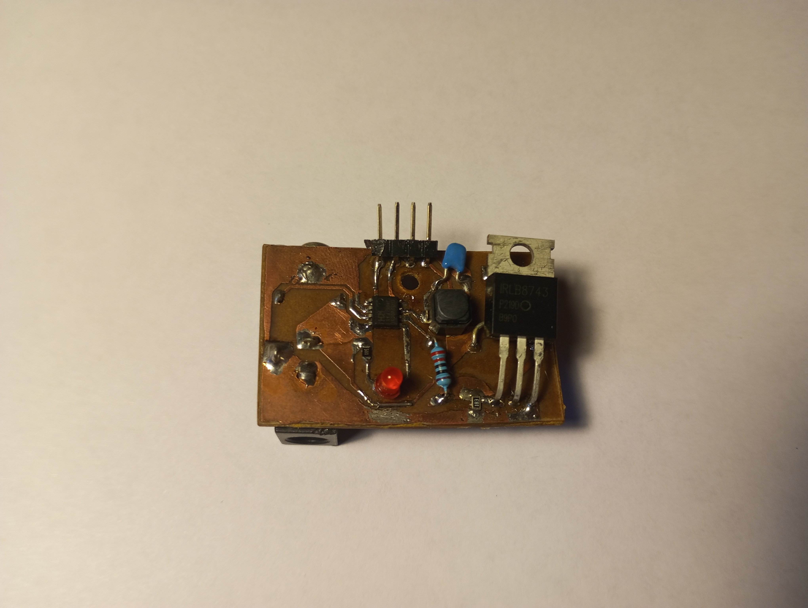
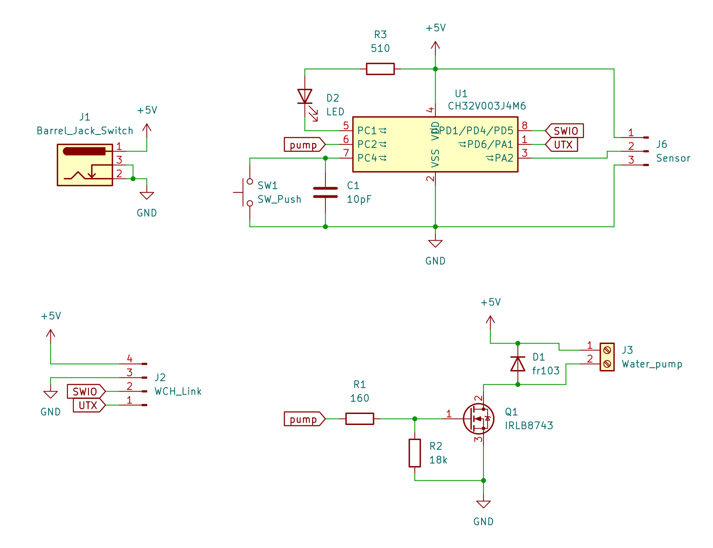

# AutoWatering
Простой проект на базе чипа ch32v003j4m6, без HAL, только на регистрах.
Поливалка цветка, использует Arduino модуль влажности почвы и какую-то помпу.



# Управление
На плате есть кнопка, светодиод, и разъемы для датчика влажнности почвы и насоса с дополнительной обвязкой.

При подклюцении питания плата сначала 5 секунд "тупит" (это надо для программирования), а потом моргает один раз светодиодом и проверяет влажность почвы, и если она суше сохраненного значения, то включает помпу на заданное время (по умолчанию 2 секунды, можете изменить в main.cpp:AWTR_WATERING_TIME). 
То же самое МК делает, если быстро нажать кнопку.

Если удержать кнопку на протяжении 2 - 3 секунд, то чип сохраняет значение датчика к себе в flash память в качестве граничного между сухой землей и влажной. После этого должен моргнуть светодиод **дважды**.

Ещё на протяжении всей работы МК отправляет в UART (4800 baudrate) сообщения с информацией, что он сейчас делает.
И если зажать кнопку дольше 5 секунд, то программа уходит в цикл, где передает значение датчика в UART и моргает светодиодом раз в секунду.

# Железо
Собирал я проект из того, что было под ногами, поэтому в моей реализации вы можете увидеть разъём Mini-Jack ля соединения датчика и платы (ну а почему бы и нет). Все компоненты здесь избыточны, поэтому подбирайте что-то своё.


# Сборка
0. Сачала в PATH системы должны быть добавлены папки с GCC от WCH и OpenOCD, или вручную прописать их в 
Makefile (ещё нужен make).
1. Cборка из исходников (если ничего не меняли, то можно пропустить)
    ```
    make build
    ```
2. Подключить WCH-LinkE и прошить.
    ```
    make load
    ```

Если чип уже был прошит этим кодом, то надо успеть в первые 5 секунд его работы. Просто я решил установить очень низкое тактирование, чтобы МК мог находиться в режиме сна более 24 часов, но как оказалось, для SDI нужна частота более 1 мегагерца, поэтому перевод к низкому тактированию происходит спустя 5 секунд. Поэтому же и частота UART должна быть достаточно низкой.